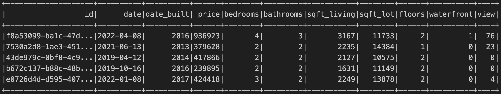

# Home_Sales 
A big data project that uses PySpark to determine key metrics about home sales data.
 

 

## Table of Contents
### Overview
### Requirements & Dependencies
### Workflow
### Discussion of Results
### Usage
### Contributing
### License
 

### Overview 
The purpose of this project is to use Spark to create temporary views, partition the data, and cache and uncache a temporary table. SparkSQL is used to run queries on the temporary views in order to answer specific questions about home sales. 

Here are some key features of the project:
- Run SparkSQL queries to answer specific questions
- Create a temporary view of the data
- Partition the data
- Cache and uncache a temporary table.

 

### Requirements & Dependencies
This project uses the following software:    

Python (version 3.10.9)

Spark (version: 3.4.0)

 

### Workflow
 

1. **Set up dependencies and read/preview the data**

     The data is read from a Amazon S3 bucket with and stored in a Spark DataFrame. The data is also previewed.

2. **Create a temporary view of the DataFrame** 

    `createOrReplaceTempView` is used to create a temporary view of the DataFrame.

3. **Print out the data types** 

    Use `printSchema` to print out the data types of the DataFrame. This is important for casting the data types when running queries.

4. **Run queries to answer specific questions** 

    Use `spark.sql` to run queries on the temporary view to answer specific questions about the data, casting the data types as needed. 

5. **Check the run time of queries**

    Use `time` and `print` to check and print out the run time of the queries.

6. **Cache the temporary view, run a query, and check the run time**   

    Use `cache table` to cache the temporary view, run a query, and check the run time of the query.

7. **Partition the data**  

    Use `partitionBy` to partition the data by the `date_built` column.

8. **Read the partitioned data and create a temporary view**  

    Read the partitioned data and create a temporary view of the DataFrame.

9. **Repeat the query fron the cached temporary view on the partitioned data and check the run time of the query**  

7. **Uncache the temporary view**

    Use `uncache table` to uncache the temporary view and check that the temporary view is no longer cached.
 

- The `home_sales.ipynb` file contains the code for the project. The results of the queries are also displayed in the notebook.

 

### Usage
1. Ensure that you have all the necessary dependencies and files/scripts. 
2. Load the project files in an appropriate code editor such as Jupyter Notebook. 
3. Run the script in the Jupyter Notebook step by step
to execute the code and visualize the results appropriately.       

### Contributions
Contributions to this project are highly encouraged! If you wish to contribute, please follow these guidelines:

- Fork the `Home_Sales` repository and clone it locally.
- Create a new branch for your feature or bug fix.
- Commit your changes with descriptive commit messages.
- Push your branch to your forked repository.
- Submit a pull request to the original repository.
- Please ensure that your code adheres to the project's coding style and conventions.

If you encounter any issues or have suggestions for improvements, please open an issue on the GitHub repository.

### License
These projects are licensed under the MIT License. Feel free to use, modify, and distribute the code as per the terms of the license. 

